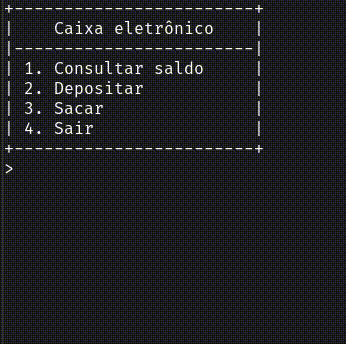

# Caixa eletrônico em CPP

## Aplicação de um caixa eletrônico, no terminal, visando estudar algumas funcionalidades linguagem CPP.

Utiliza-se como banco de dados embarcado o SQLite3. O programa apresentada um menu inicial no qual o usuário pode decidir por três operações, quais sejam "Consular saldo", "Depositar", "Sacar" ou "Sair", digitando no teclado, o número correspondente.

As informações são consultadas do banco de dados contido na aplicação.

## 💻 Pré-requisitos

Antes de começar, verifique os seguintes requisitos:

+ [Compilador GCC](https://gcc.gnu.org/install/)
+ GNU Make
+ [SQLite3](https://www.sqlite.org/download.html)

## 🧰 Linguagens utilizadas
+ 

## ⚙️ Utilização
+ Faça o download do repositório com o comando _git clone https://github.com/GuilhermeSantos99/Caixa-Eletronico.git_
+ Na pasta do download, abra o terminal execute e comando: _make_ para compilar o código
+ Execute o comando _./atm_ para executar o código

## 📮 Contribuindo para o Terminal Caixa Eletrônico

Para contribuir com o projeto, siga estas etapas:

1. _Fork_ este repositório.
2. Clone o seu repositório _forkado_ com o comando _git clone <link do repositório>_.
3. Faça suas alterações e confirme-as: _git commit -m '<mensagem_commit>'_
4. Envie para o branch original: _git push origin <nome_do_projeto> / <local>_
5. Crie a solicitação de pull.

+ Caso queira me mandar uma mensagem, fique à vontade: 

